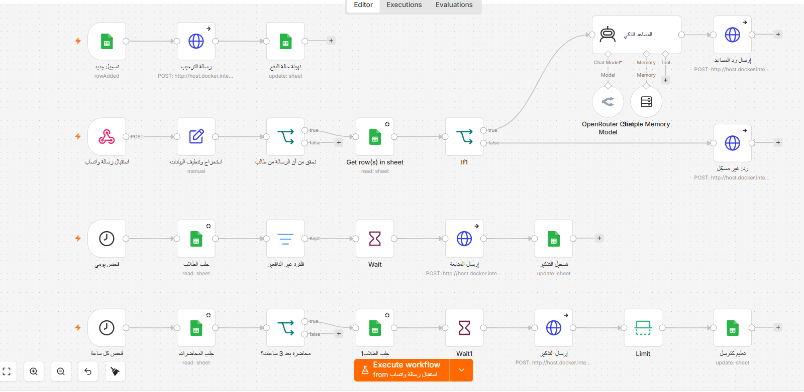

# AI Course Manager

A WhatsApp system that runs the full learner lifecycle for an online course:
enrollment onboarding, conversational support, payment follow-up, and lecture
reminders.

Four independent workflows share one Google Sheets database. WhatsApp
connectivity comes from a **self-hosted Evolution API instance running in
Docker**, so the system has no dependency on a paid messaging gateway.

`27 nodes` · `4 workflows` · `4 triggers`

> Built as a training project. No learner data is included; all identifiers in
> the export are placeholders.

---

## The problem

Course administration is a set of small obligations that each cost almost
nothing and collectively cost the whole evening: greeting every new signup,
answering the same questions in different words, chasing unpaid seats without
becoming a nuisance, and reminding everyone before each lecture.

All four are triggered by an event or a clock, not by judgement — which makes
them automatable. The interesting part is doing it without the system behaving
like a spam bot.

## How it works

### 1 · Enrollment onboarding

A Google Form writes to the sheet. A `rowAdded` trigger fires, sends a welcome
message confirming the recorded details, and initialises the learner's payment
status.

### 2 · Conversational support

Evolution API posts inbound messages to a webhook. A Set node flattens the
payload into `phone`, `text`, `fromMe`, `pushName`, `isPrivate`. A gate then
requires all three of: a non-empty phone, `fromMe = false`, and `isPrivate =
true` — dropping the bot's own echoes and every group message before anything
else runs.

Surviving messages are looked up in the sheet. Registered learners reach the AI
agent; unregistered numbers get a fixed reply.

### 3 · Payment follow-up

A daily schedule reads all learners and filters to those who meet **three**
conditions: payment status is unpaid, fewer than 3 reminders sent, and more than
48 hours since the last one. Each send writes the reminder count and timestamp
back, which is what makes the next day's filter correct.

### 4 · Lecture reminders

An hourly schedule reads the lecture table and keeps rows where the lecture is
in the future, less than three hours away, and `reminder_sent` is false. It
fetches learners, sends, then marks the lecture as sent so the next hourly run
skips it.

### Architecture

## Design decisions

**Self-hosted Evolution API instead of a paid gateway.** Running the WhatsApp
bridge in Docker removes the per-message cost and the vendor dependency, at the
price of owning uptime and session management. For a course operator sending a
few hundred messages a month, that trade is clearly worth making.

**State lives in the sheet, not in the workflow.** `عدد مرات التذكير`,
`آخر تذكير`, and `reminder_sent` are written back after every send. The
schedules are therefore stateless: an hourly job that re-reads the same rows
produces the same decision, and a missed run self-corrects on the next tick
instead of double-sending.

**Three conditions before a payment reminder, not one.** Capping at 3 reminders
and enforcing a 48-hour gap is what separates follow-up from harassment. A
system that messages people is judged on its worst behaviour, not its average.

**Rejecting non-learner traffic at the edge.** The `fromMe` and `isPrivate`
checks run immediately after payload extraction, before any sheet read or model
call — so group chatter and the bot's own echoes cost nothing and cannot loop.

**The agent reads live learner context.** The system prompt is interpolated with
each learner's name, payment status, prior technical experience, stated goal, and
whether they own a suitable computer — pulled from the sheet on every message.
Replies adapt their vocabulary to a beginner or a developer, and the framing to
someone seeking career change or automating their own business. It is
personalisation from records, not a static persona.

## Data model

| Sheet | Key columns |
|---|---|
| `Students` | name, WhatsApp number, payment status, reminder count, last reminder, experience, goal, hardware |
| `Lectures` | `lecture_id`, `lecture_datetime`, `reminder_sent` |

## Known limitations

- **The `Limit` node in workflow 4 collapses the per-learner fan-out back to a
  single item so the lecture is marked sent once rather than once per learner.
  It defaults to keeping one item, so if two lectures fall inside the same
  three-hour window, only one gets marked — the other will be re-sent on the
  next hourly run.** The fix is to split marking from sending rather than
  relying on `Limit`. Left in place and documented rather than quietly patched.
- The `Wait` nodes stagger sends but do not implement real backoff; a failed
  send is not retried.
- Inbound handling reads `message.conversation` only, so media messages are
  ignored rather than answered.
- Google Sheets as a datastore has no transactions and will not hold up past a
  few hundred learners.

## Running it

1. Stand up Evolution API in Docker and connect a WhatsApp session.
2. Import `workflow.json`; point the send nodes at your instance host.
3. Store the Evolution API key as an n8n **credential**, not as a header typed
   into the HTTP node.
4. Add OpenRouter and Google Sheets credentials.
5. Create the workbook and Form; replace `YOUR_SHEET_ID` and `YOUR_FORM_ID`.
6. Register the webhook URL in Evolution API and activate.
