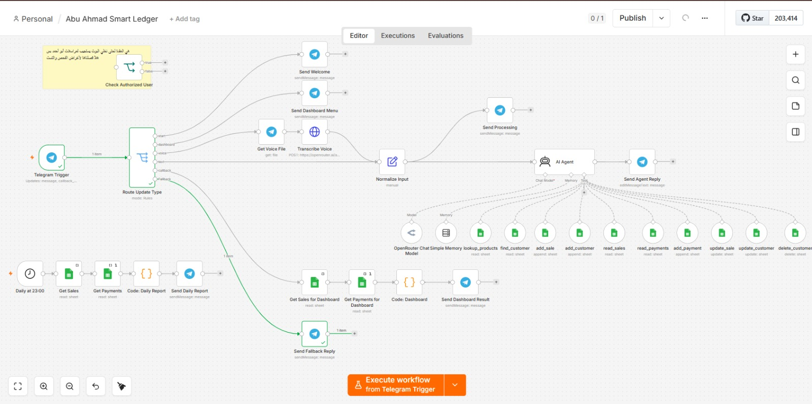
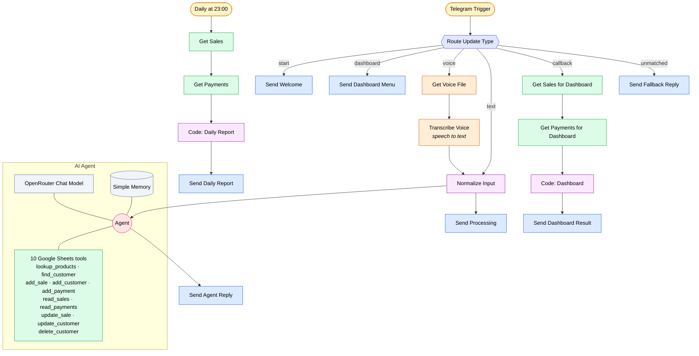

# Smart Retail Assistant

A Telegram-operated ledger for a small retail shop, built in n8n.

The owner runs the whole day's bookkeeping from a chat window — recording sales,
logging customer debt payments, checking who owes what, updating prices — by
typing or **sending a voice note in Arabic**. An AI agent interprets the request
and calls the right database operation. At 23:00 a scheduled workflow sends the
day's closing report unprompted.

`33 nodes` · `2 triggers` · `10 AI agent tools` · `6 routed paths`

> Built as a training project. No shop data is included; all identifiers in the
> export are placeholders.

---

## The problem

A shop owner already carries a phone and already uses Telegram. Anything that
requires opening a laptop, learning a POS interface, or typing structured input
will not survive contact with a busy shop floor.

Two constraints shaped the design:

- **Input has to be as cheap as speaking.** Hands are often full. Typing a
  structured entry mid-transaction is not realistic, so voice had to be a
  first-class input path rather than an afterthought.
- **The owner should never be the one who remembers to run a report.** Anything
  that depends on remembering will be skipped. The daily close is therefore
  pushed on a schedule, not pulled on request.

## How it works

Two independent entry points:

**Conversational** — a Telegram trigger receives every update. A switch routes
six kinds of update to six different paths. Text goes straight to
normalization; voice is downloaded from Telegram, transcribed to text, and then
joins the same normalization step, so everything downstream is channel-agnostic.
An AI agent with ten Google Sheets tools decides which operation the request
maps to and executes it.

**Scheduled** — at 23:00 a separate branch reads the day's sales and payments,
computes the closing figures in a Code node, and sends the report.

### Architecture

## Design decisions

**Voice and text converge before the agent.** The transcription path rejoins at
`Normalize Input`, so the agent has one input contract and no branch-specific
handling. Adding a third channel later means one new path into the same node,
not a second copy of the agent.

**The agent owns the operations, the workflow owns the routing.** Deterministic
concerns — is this a `/start`, a button callback, a voice note? — are handled by
a switch, which is cheap and predictable. Only genuinely ambiguous natural
language reaches the LLM. Routing a button press through a model would be slower,
costlier, and less reliable than an equality check.

**Ten narrow tools instead of one broad one.** Each Sheets operation is exposed
as its own named tool, so tool selection is a classification the model is good at
rather than argument construction it is bad at. It also means a wrong call fails
in a small, visible way.

**An acknowledgement fires in parallel with the agent.** `Normalize Input` fans
out to both `Send Processing` and the agent, so the user sees a response
immediately instead of waiting on transcription plus inference plus a sheet
write.

## Data model

A single Google Sheets workbook:

| Sheet | Purpose |
|---|---|
| `Products` | catalogue and pricing, read by `lookup_products` |
| `Customers` | customer records and debt balances |
| `Sales` | one row per sale |
| `Payments` | one row per debt payment |

## Access control

`Check Authorized User` compares the incoming chat id against the owner's, so
only the shop owner can write to the ledger.

**This node is not wired into the graph in the published export** — it was
disconnected during testing and the sticky note in the canvas says so. Reconnect
it between `Telegram Trigger` and `Route Update Type`, with the true branch
continuing to the switch, before running this against anything real. A bot that
writes to a ledger must not answer strangers.

## Known limitations

- Single-tenant: one owner, one workbook, ids hardcoded rather than looked up.
- Google Sheets is the datastore. Fine at this scale, but there are no
  transactions — two concurrent writes can interleave.
- Transcription quality on Arabic dialect audio in a noisy shop is the weakest
  link in the voice path and has not been measured.

## Running it

1. Import `workflow.json`.
2. Create a Telegram bot via BotFather; add it as a Telegram credential.
3. Add an OpenRouter credential. **Use a credential, not a header typed into the
   HTTP node** — that is how the original export leaked a key.
4. Create the workbook with the four sheets above; replace every
   `YOUR_SHEET_ID`.
5. Set your chat id in `Check Authorized User` and reconnect it.
6. Activate. Send `/start`.
